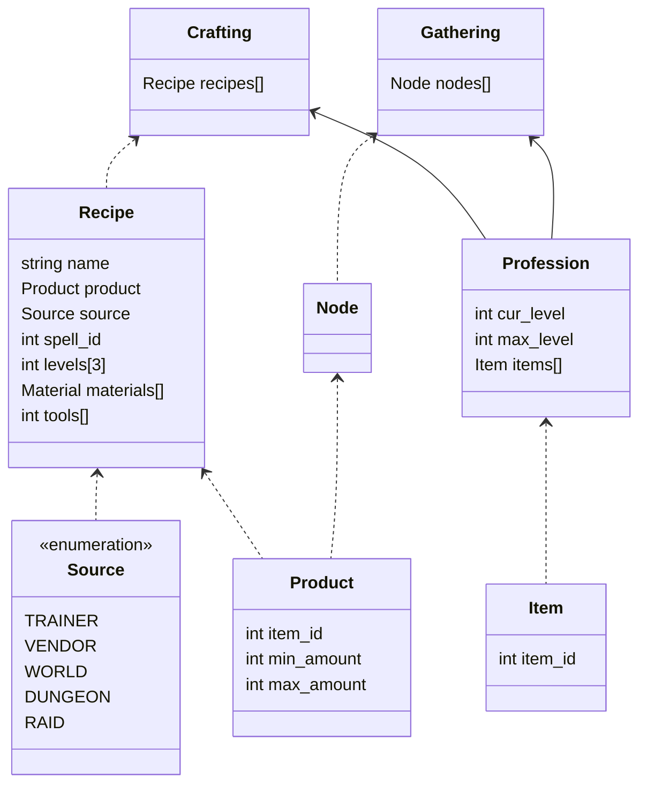
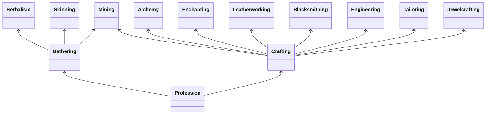
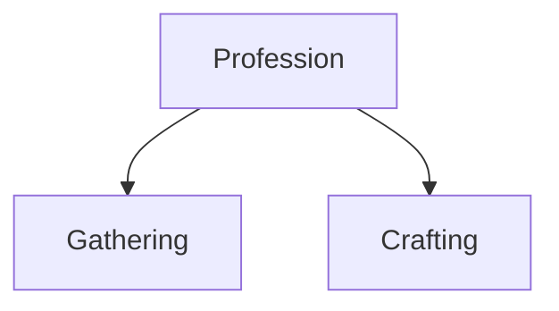
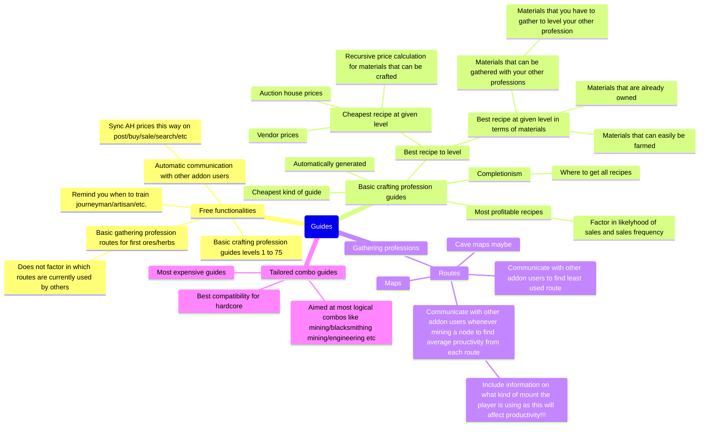
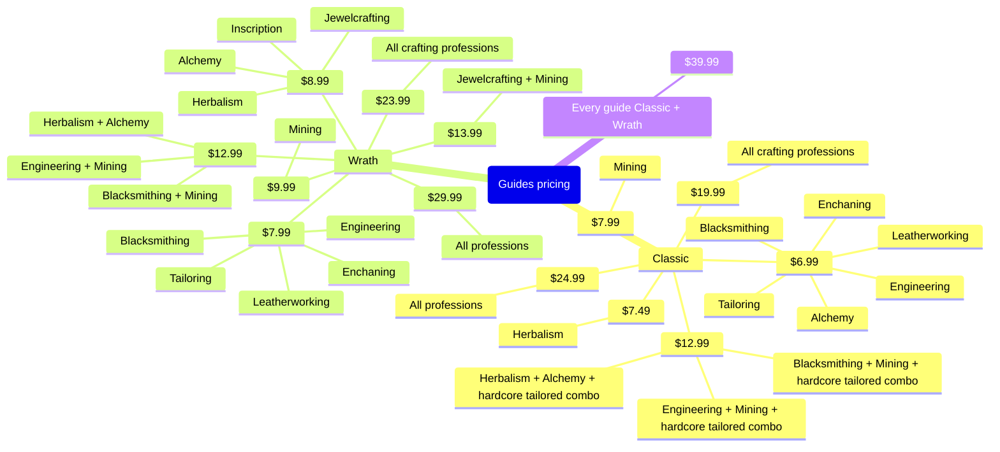

```mermaid
classDiagram
Recipe <.. Source
Profession <.. Item
Crafting <.. Recipe
Crafting <-- Profession
Gathering <-- Profession
Gathering <.. Node
Recipe <.. Product
Node <.. Product

Profession : int cur_level
Profession : int max_level
Profession : Item items[]

Gathering : Node nodes[]
Crafting : Recipe recipes[]

Recipe : string name
Recipe : Product product
Recipe : Source source
Recipe : int spell_id
Recipe : int levels[3]
Recipe : Material materials[]
Recipe : int tools[]

Product : int item_id
Product : int min_amount
Product : int max_amount

Item : int item_id

class Source {
    <<enumeration>>
    TRAINER
    VENDOR
    WORLD
    DUNGEON
    RAID
}
```

```mermaid
classDiagram
Gathering <-- Profession
Crafting <-- Profession

Herbalism <-- Gathering
Skinning <-- Gathering
Mining <-- Gathering
Mining <-- Crafting

Alchemy <-- Crafting
Enchanting <-- Crafting
Leatherworking <-- Crafting
Blacksmithing <-- Crafting
Engineering <-- Crafting
Tailoring <-- Crafting

Jewelcrafting <-- Crafting
```

```mermaid
graph TD;
Profession --> Gathering
Profession --> Crafting
```

```mermaid
mindmap
root(Guides)
    Free functionalities
        Basic crafting profession guides levels 1 to 75
        Basic gathering profession routes for first ores/herbs
            Does not factor in which routes are currently used by others
        Automatic communication with other addon users
            Sync AH prices this way on post/buy/sale/search/etc
        Remind you when to train journeyman/artisan/etc.
    Basic crafting profession guides
        Completionism
            Where to get all recipes
        Automatically generated
        Cheapest kind of guide
        Best recipe to level
            Cheapest recipe at given level
                Vendor prices
                Auction house prices
                Recursive price calculation for materials that can be crafted
            Best recipe at given level in terms of materials
                Materials that are already owned
                Materials that can be gathered with your other professions
                    Materials that you have to gather to level your other profession
                Materials that can easily be farmed
        Most profitable recipes
            Factor in likelyhood of sales and sales frequency
    Gathering professions
        Routes
            Communicate with other addon users to find least used route
            Communicate with other addon users whenever mining a node to find average prouctivity from each route
                Include information on what kind of mount the player is using as this will affect productivity!!!
            Maps
            Cave maps maybe
    Tailored combo guides
        Most expensive guides
        Aimed at most logical combos like mining/blacksmithing mining/engineering etc
        Best compatibility for hardcore
```

```mermaid
mindmap
root(Guides pricing)
    Classic
        $6.99
            Blacksmithing
            Engineering
            Leatherworking
            Tailoring
            Enchaning
            Alchemy
        $7.49
            Herbalism
        $7.99
            Mining
        $12.99
            Blacksmithing + Mining + hardcore tailored combo
            Engineering + Mining + hardcore tailored combo
            Herbalism + Alchemy + hardcore tailored combo
        $19.99
            All crafting professions
        $24.99
            All professions
    Wrath
        $7.99
            Blacksmithing
            Engineering
            Leatherworking
            Tailoring
            Enchaning
        $8.99
            Jewelcrafting
            Inscription
            Alchemy
            Herbalism
        $9.99
            Mining
        $12.99
            Blacksmithing + Mining
            Engineering + Mining
            Herbalism + Alchemy
        $13.99
            Jewelcrafting + Mining
        $23.99
            All crafting professions
        $29.99
            All professions
    Every guide Classic + Wrath
        $39.99
```
